# Puffer Soccer — Thesis Defense Reproduction

This branch (`gallant-plotting-backup-2026-04-23`) is the snapshot used for
**Franklin Yiu's master's thesis defense (2026-04-23)**.

It contains, force-added under the otherwise-gitignored `experiments/`:

- The slide deck (`docs/thesis_defense_2026-04-23.pdf`)
- Every plot shown in the slides, with the script and data cache that
  produced it
- The trained policy (`experiments/61xajhha/model_049520.pt`), the warmstart
  cache (`experiments/cached_warm_start.pt`), and all 248 stride-200
  intermediate checkpoints
- The final-checkpoint trace (input to the occupancy / clip-extraction
  scripts) and the 50 emergence-stats JSONs (input to every emergence plot)
- The two policy videos shown in slide 12 and the warmstart video shown in
  slide 10
- The value-trajectory videos and the curated dribble / pass / goalie /
  defender / forward clips shown in slides 16–20 and 24

The run id is `61xajhha` (Slurm job `6856525`): 50,000 self-play epochs
with the gallant regularized-RL update (PPO + KL-to-past + KL-to-uniform),
loaded from the no-opponent curriculum warmstart `y3id1i7o` (job `6849509`).

## Plot index — checklist against the slides

Each entry below shows the slide, the rendered plot embedded inline, and
the script + data inputs needed to remake it. If a plot from the deck is
missing from this list, it is missing from the repo — please flag it.

### Slide 8 — Regularized RL Algorithm (architecture diagram)

[`docs/gallant_regularized_rl_arch.svg`](docs/gallant_regularized_rl_arch.svg).

### Slide 10 — Pure MMD doesn't work; warmstart curriculum

Warmstart-policy self-play (no opponent):
[`experiments/y3id1i7o/video/self_play_no_opponent.mp4`](experiments/y3id1i7o/video/self_play_no_opponent.mp4).

### Slide 12 — Policy Video

Final-policy self-play and best-checkpoint videos:

- [`experiments/61xajhha/video/self_play.mp4`](experiments/61xajhha/video/self_play.mp4)
- [`experiments/61xajhha/video/best_checkpoint.mp4`](experiments/61xajhha/video/best_checkpoint.mp4)

### Slide 14 — Ball Touches

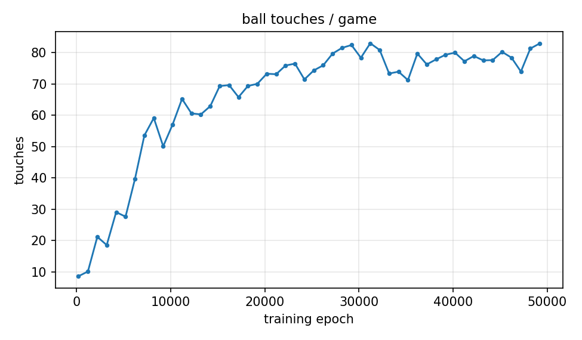

Script: `scripts/plot_emergence_individual.py` reading
`experiments/teamplay_trace/61xajhha/stats/`.

### Slide 15 — Field Coverage (ball x-position entropy)

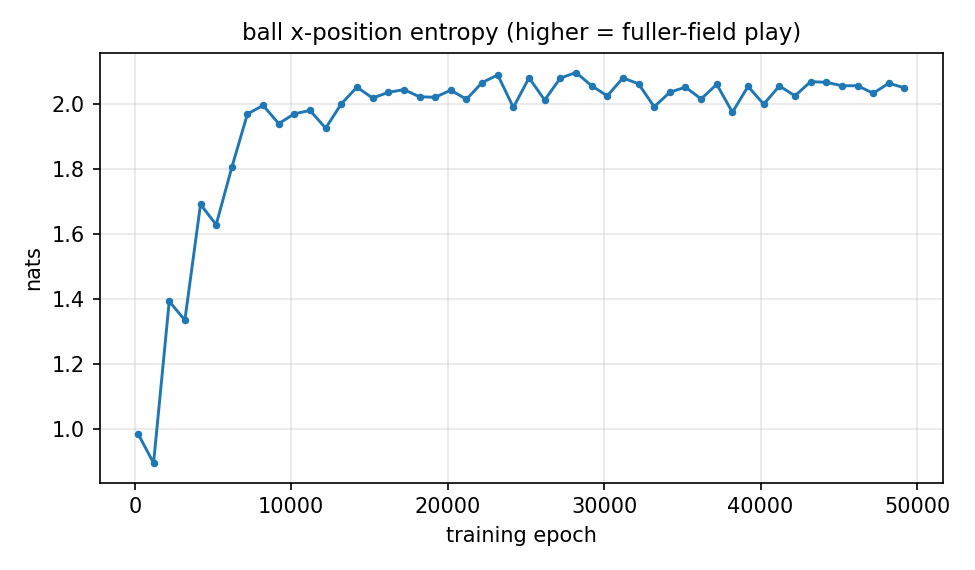

Script: `scripts/plot_emergence_individual.py`.

### Slide 16 — Dribbling

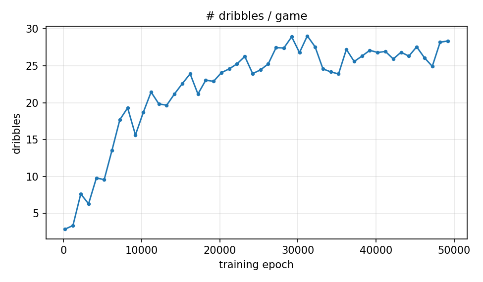

Script: `scripts/plot_emergence_individual.py`.

Curated dribble clips (`scripts/extract_dribble_pass_clips.py`,
input: final-checkpoint trace at
`experiments/teamplay_trace/61xajhha/traces/trace_epoch_049200.npz`):
[`experiments/autoloop/plots/clips/dribble/`](experiments/autoloop/plots/clips/dribble/) — 4 clips with `.txt` captions.

### Slide 17 — Passing

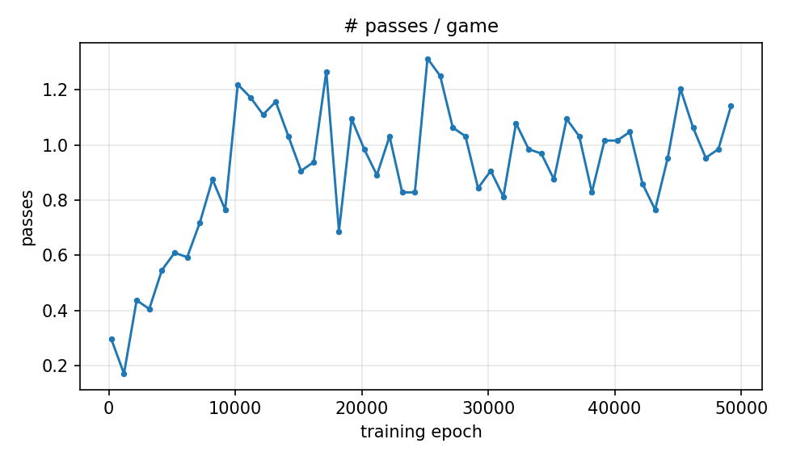

Script: `scripts/plot_emergence_individual.py`.

Curated pass clips (`scripts/extract_dribble_pass_clips.py`):
[`experiments/autoloop/plots/clips/pass/`](experiments/autoloop/plots/clips/pass/) — 3 clips with `.txt` captions.

### Slide 18 — Goalie

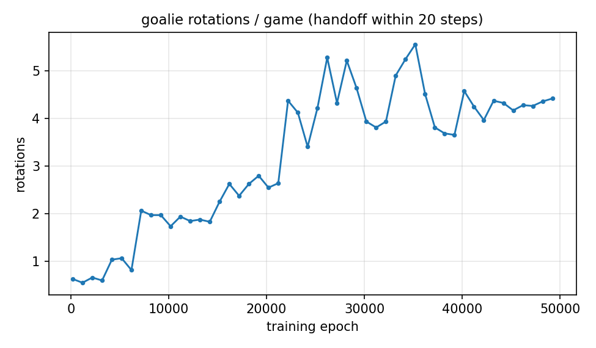


Script: `scripts/plot_emergence_individual.py`.

Goalie-rotation clips (`scripts/extract_goalie_transition_clips.py`):
[`experiments/autoloop/plots/clips/goalie_transition/`](experiments/autoloop/plots/clips/goalie_transition/) — 4 clips, with team / handoff
agents / possession / forward-extent encoded in the filenames.

### Slide 19 — Defensive Players

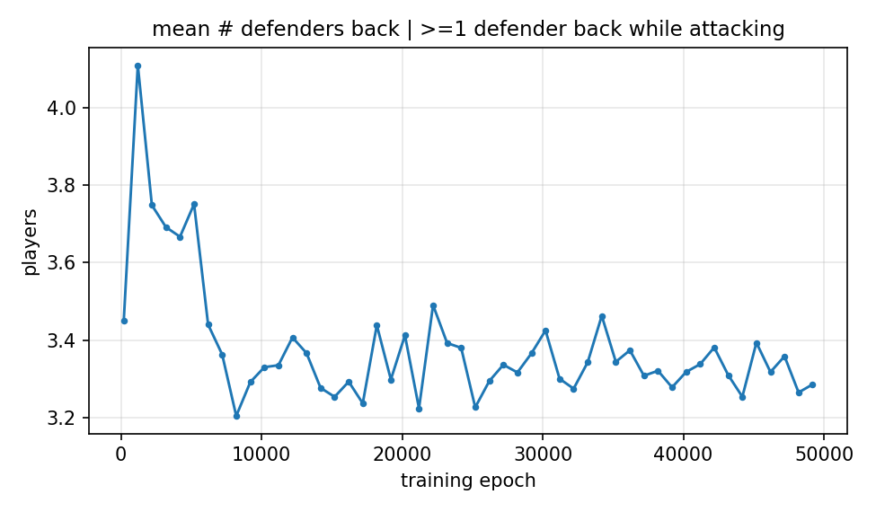

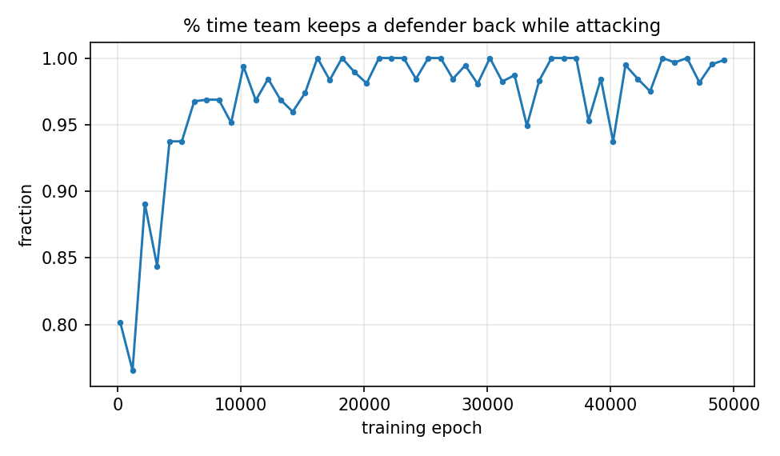

Script: `scripts/plot_emergence_individual.py`.

Defender-vs-offense behavior clips (`scripts/extract_behavior_clips.py`):
[`experiments/autoloop/plots/clips/def_vs_off/`](experiments/autoloop/plots/clips/def_vs_off/) — 4 clips with `.txt` captions.

### Slide 20 — Offensive Players


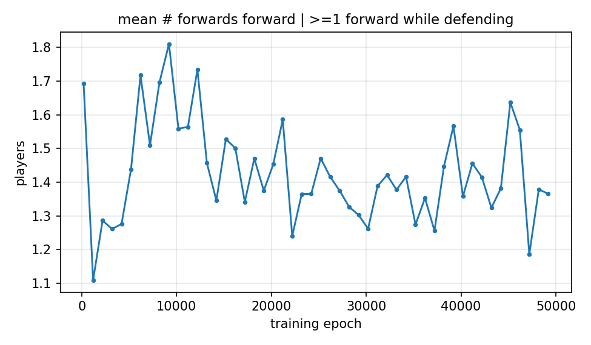

Script: `scripts/plot_emergence_individual.py`.

Forward-vs-defense behavior clips (`scripts/extract_behavior_clips.py`):
[`experiments/autoloop/plots/clips/fwd_vs_def/`](experiments/autoloop/plots/clips/fwd_vs_def/) — 4 clips with `.txt` captions.

### Slide 21 — Bias Towards Defense (per-team occupancy heatmaps)

| blue team (attacks +x) | red team (attacks −x) |
|---|---|
| 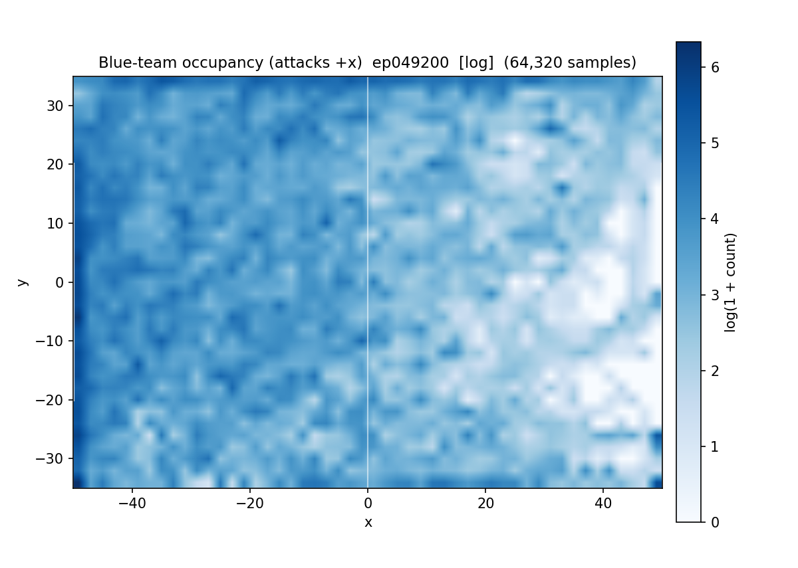 |  |

Script: `scripts/plot_occupancy_heatmaps.py` reading
`experiments/teamplay_trace/61xajhha/traces/trace_epoch_049200.npz`.

### Slide 22 — Agents tend to play along the sides (ball occupancy)

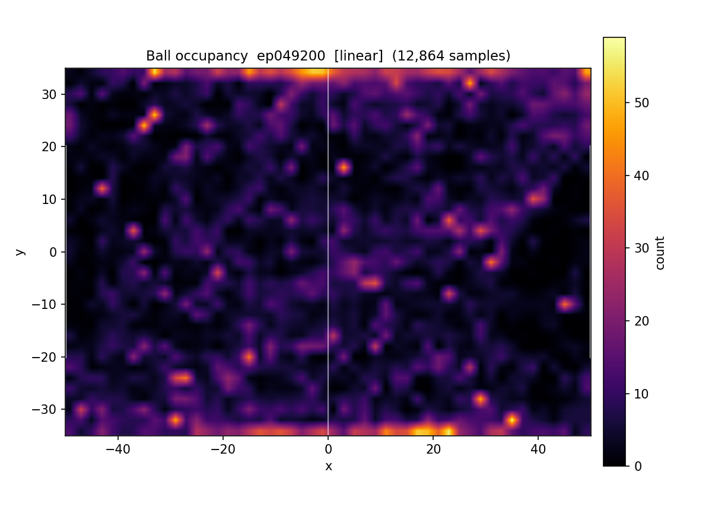

Script: `scripts/plot_occupancy_heatmaps.py`.

### Slide 24 — Critic's value rises as the scoring team approaches the goal

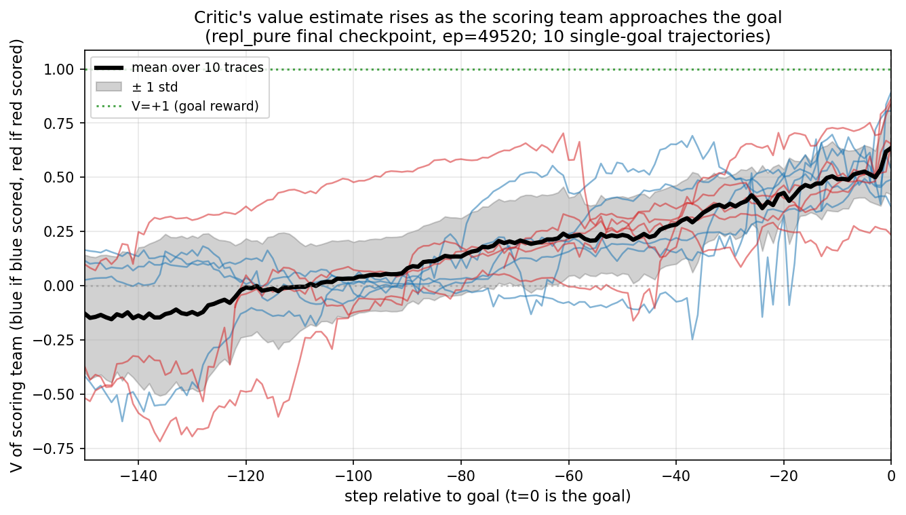

Script: `scripts/value_along_trajectory.py`. Cached data:
[`experiments/autoloop/value_trajectory/trajectories.npz`](experiments/autoloop/value_trajectory/trajectories.npz),
[`experiments/autoloop/value_trajectory/trajectory_summary.json`](experiments/autoloop/value_trajectory/trajectory_summary.json).
The 10 example single-goal trajectories (5 blue, 5 red) are rendered to
mp4 in [`experiments/autoloop/value_trajectory/videos/`](experiments/autoloop/value_trajectory/videos/).

### Slide 25 — V(carrier) under varied formations


Script: `scripts/formation_value_heatmap.py`. Cached data:
[`experiments/autoloop/formation/formation_v.npy`](experiments/autoloop/formation/formation_v.npy).

### Slide 26 — Goalie ΔV across blue/red line positions


Script: `scripts/formation_value_goalie_delta.py`. Cached data:
[`experiments/autoloop/formation/formation_v.npy`](experiments/autoloop/formation/formation_v.npy),
[`experiments/autoloop/formation/formation_v_no_goalie.npy`](experiments/autoloop/formation/formation_v_no_goalie.npy).

### Slide 27 — Goalie value in a realistic mid-attack state

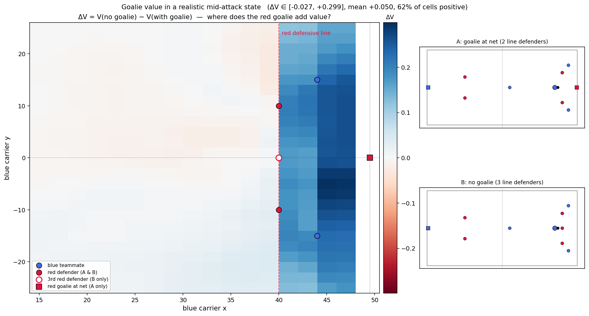

Script: `scripts/goalie_save_region.py`. Cached data:
[`experiments/autoloop/formation/goalie_save_region_v_no.npy`](experiments/autoloop/formation/goalie_save_region_v_no.npy),
[`experiments/autoloop/formation/goalie_save_region_v_with.npy`](experiments/autoloop/formation/goalie_save_region_v_with.npy).

---

## Reproducing the plots

`uv sync --extra dev` and the env at this commit. The trained policy is
`experiments/61xajhha/model_049520.pt`; the warmstart is
`experiments/cached_warm_start.pt`.

```bash
# Emergence stats — slow, walks every checkpoint and writes stats + traces
uv run python scripts/teamplay_trace.py \
  --checkpoint-dir experiments/61xajhha \
  --output-dir experiments/teamplay_trace/61xajhha \
  --stride 5 \
  --save-traces \
  --traces-final-only

# Per-metric emergence panels (slides 14, 15, 16, 17, 18, 19, 20)
uv run python scripts/plot_emergence_individual.py \
  --input-dir experiments/teamplay_trace/61xajhha/stats \
  --output-dir experiments/autoloop/plots/emergence

# Occupancy heatmaps (slides 21, 22)
uv run python scripts/plot_occupancy_heatmaps.py \
  --traces experiments/teamplay_trace/61xajhha/traces/trace_epoch_049200.npz \
  --output-dir experiments/autoloop/plots/occupancy

# Value along trajectory (slide 24)
uv run python scripts/value_along_trajectory.py \
  --checkpoint experiments/61xajhha/model_049520.pt \
  --output-dir experiments/autoloop/value_trajectory

# Formation value heatmap (slide 25) and goalie delta (slide 26)
uv run python scripts/formation_value_heatmap.py \
  --checkpoint experiments/61xajhha/model_049520.pt \
  --output-dir experiments/autoloop/formation
uv run python scripts/formation_value_goalie_delta.py \
  --checkpoint experiments/61xajhha/model_049520.pt \
  --output-dir experiments/autoloop/formation

# Goalie save region (slide 27)
uv run python scripts/goalie_save_region.py \
  --checkpoint experiments/61xajhha/model_049520.pt \
  --output-dir experiments/autoloop/formation

# Behavior clips (slides 16, 17, 18, 19, 20)
uv run python scripts/extract_dribble_pass_clips.py \
  --traces experiments/teamplay_trace/61xajhha/traces/trace_epoch_049200.npz \
  --output-dir experiments/autoloop/plots/clips
uv run python scripts/extract_goalie_transition_clips.py \
  --traces experiments/teamplay_trace/61xajhha/traces/trace_epoch_049200.npz \
  --output-dir experiments/autoloop/plots/clips
uv run python scripts/extract_behavior_clips.py \
  --traces experiments/teamplay_trace/61xajhha/traces/trace_epoch_049200.npz \
  --output-dir experiments/autoloop/plots/clips
```

---

# Puffer Soccer

Native C-backed MARL 2D soccer environment for PufferLib.

## Install

```bash
uv sync --extra dev
```

## Quick demo

```bash
uv run python main.py
```

## Train (PuffeRL PPO baseline)

```bash
uv run scripts/train_pufferl.py --players-per-team 5 --vec-backend auto --ppo-iterations 1000
```

This writes a self-play video at `experiments/self_play.mp4` after training.
W&B logging is enabled by default with the `robot-soccer` project and logs the generated self-play video to the same run.

The training path runs directly on `MARL2DPufferEnv` without a PettingZoo wrapper or Python serial vectorizer.

To autotune the vector layout on the current machine before training, use the auto backend.
This runs a short pre-training sweep over vector layouts, prefers near-100% CPU usage,
and then trains with the fastest selected configuration:

```bash
uv run python scripts/train_pufferl.py \
  --players-per-team 5 \
  --ppo-iterations 1000 \
  --vec-backend auto
```

For higher CPU throughput, use Puffer's multiprocessing vecenv with small native shards per worker:

```bash
uv run python scripts/train_pufferl.py \
  --players-per-team 5 \
  --ppo-iterations 1000 \
  --vec-backend multiprocessing \
  --num-envs 3072 \
  --vec-num-shards 16 \
  --vec-batch-size 1
```

## Benchmark

```bash
uv run python scripts/benchmark_sps.py --num-envs 64 --seconds 10 --action-mode discrete
```

Autotune across native and multiprocessing layouts until the CPU saturates, then pick the highest-SPS configuration:

```bash
uv run python scripts/benchmark_sps.py --backend auto --players-per-team 5 --autotune --seconds 3 --action-mode discrete

# `--seconds` is optional; autotune uses a built-in short sample and stops once
# it reaches near-100% CPU usage and SPS plateaus.
```

Benchmark the Puffer multiprocessing layout directly:

```bash
uv run python scripts/benchmark_sps.py \
  --backend multiprocessing \
  --players-per-team 5 \
  --shard-num-envs-list 160,192,224 \
  --num-shards-list 16 \
  --batch-size-list 1,2,4 \
  --seconds 3
```

## Tests

```bash
uv run pytest -q
```

`tests/test_parity.py` compares against `third-party/MARL2DFootball` when its dependencies are available.
